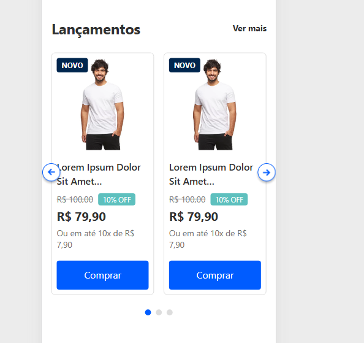

# Site de Marketplace

Este projeto é um **site de marketplace** construído inteiramente com **HTML puro**, **JavaScript** e estilizado usando **Tailwind CSS**. Ele é totalmente responsivo e otimizado para telas menores que 768px.

## Funcionalidades

- **Design Responsivo**: Adapta-se perfeitamente a telas menores (menos de 768px).
- **HTML e JavaScript puros**: Sem frameworks ou bibliotecas externas para funcionalidade.
- **Tailwind CSS**: Para um estilo moderno e eficiente.

## Como Usar

1. Clone o repositório para sua máquina local.
2. Abra o arquivo `index.html` no seu navegador para visualizar o site.
3. Explore os recursos do marketplace.

## Tecnologias Utilizadas

- **HTML**: Estrutura do site.
- **JavaScript**: Interatividade e funcionalidade.
- **Tailwind CSS**: Estilização e responsividade.

## Capturas de Tela

